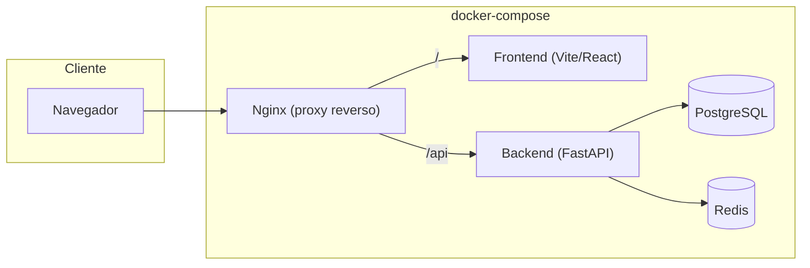
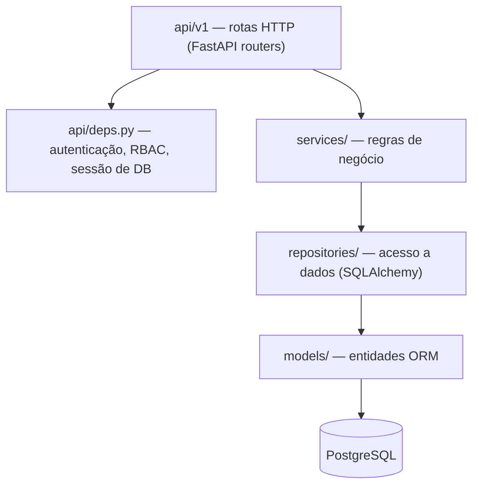
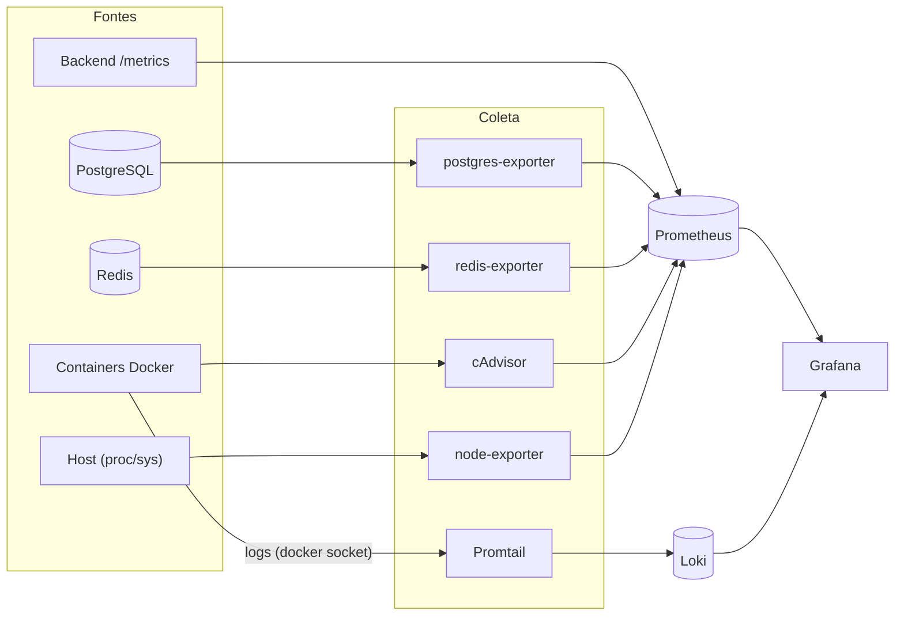

# Arquitetura — InfraHub

## Visão geral

O InfraHub é dividido em três blocos independentes, cada um com seu próprio Dockerfile, orquestrados pelo Docker Compose:

- **backend/** — API REST em FastAPI, organizada em camadas (Clean Architecture simplificada).
- **frontend/** — SPA em React + Vite, consumindo a API via React Query.
- **infra/** — configuração do Nginx (proxy reverso / servidor de estáticos).

> Em produção (`docker-compose.prod.yml`), o Nginx passa a servir os arquivos estáticos do build do frontend diretamente, sem o container `frontend`.

## Backend — arquitetura em camadas

- **api/**: rotas finas — validam entrada (Pydantic), chamam um service e traduzem exceções de domínio em `HTTPException`.
- **services/**: contêm as regras de negócio (ex.: `AuthService.authenticate`, `UserService.create_user`). Não conhecem HTTP nem SQL diretamente — dependem de repositórios.
- **repositories/**: isolam consultas SQLAlchemy. Trocar de ORM ou adicionar cache afeta só esta camada.
- **models/**: entidades mapeadas via SQLAlchemy 2.0 (`Mapped`/`mapped_column`).
- **core/**: infraestrutura transversal — configuração (`pydantic-settings`), segurança (hash de senha, JWT), logging estruturado, conexões de banco/cache.

Esse desenho segue os princípios SOLID: cada camada tem uma única responsabilidade (SRP), rotas dependem de abstrações de serviço (DIP) e novos módulos (inventário, wiki, auditoria) podem ser adicionados como novos conjuntos de model/repository/service/router sem alterar o que já existe (OCP).

## Autenticação e RBAC

- Login (`POST /api/v1/auth/login`) valida credenciais e emite um JWT de acesso contendo `sub` (id do usuário) e `role`.
- `api/deps.py` expõe `get_current_user` (decodifica e valida o token) e `require_roles(*roles)`, uma dependency factory usada para proteger rotas por perfil.
- Quatro perfis: **Administrador**, **Analista**, **Operador**, **Visualizador** (`app/models/user.py::UserRole`). Na Fase 1 apenas o Administrador tem rotas exclusivas (`GET/POST /users`); os demais perfis serão usados pelos módulos de negócio nas próximas fases.
- Um usuário administrador inicial é criado automaticamente no primeiro start (lifespan do FastAPI), a partir de `INITIAL_ADMIN_EMAIL` / `INITIAL_ADMIN_PASSWORD` no `.env`.

## Inventário de ativos (Fase 3)

- Modelo único `Asset` (`app/models/asset.py`) para os cinco tipos de ativo (Servidor, VM, Equipamento de Rede, Container, Aplicação), com campos comuns em colunas normais e os campos específicos de cada tipo em uma coluna `attributes` (JSONB). Evita 5 tabelas quase-duplicadas nesta fase e mantém uma única migration.
- A validação de que `attributes` bate com o `asset_type` acontece na camada de schema (`app/schemas/asset.py`), com um Pydantic model por tipo (ex.: `ServerAttributes`, `NetworkDeviceAttributes`) selecionado dinamicamente por um `model_validator`. Isso mantém o banco flexível sem abrir mão de validação forte na API.
- Segue exatamente o mesmo padrão de camadas dos usuários: `AssetRepository`/`AssetService`/`api/v1/assets.py`, reaproveitando `BaseRepository` (agora também com `update`/`delete` genéricos) e a dependency `require_roles` já existente.
- RBAC: leitura liberada para qualquer usuário autenticado; criar/editar exige Administrador, Analista ou Operador; excluir exige Administrador.

## Wiki técnica e anexos (Fase 4)

- **Documentação**: em vez de um endpoint dedicado, `documentation` é só mais um campo em `Asset`/`AssetUpdate` — reaproveita o `PATCH /assets/{id}` e o RBAC já existentes, sem nova rota nem nova regra de permissão.
- **Anexos**: modelo `AssetAttachment` (`app/models/attachment.py`) próprio, com repository/service/router seguindo o mesmo padrão de camadas (`AttachmentRepository`, `AttachmentService`, `api/v1/attachments.py`, montado em `/assets/{asset_id}/attachments`).
- **Armazenamento em disco** centralizado em `app/core/storage.py`: gera caminhos únicos e seguros (`storage/uploads/<asset_id>/<uuid>_<nome-sanitizado>`) e limpa a pasta de um ativo quando ele é excluído (chamado a partir de `AssetService.delete_asset`, evitando arquivos órfãos). É o único módulo que sabe onde os arquivos ficam — tanto o service de anexos quanto a exclusão de ativos dependem dele, em vez de duplicar a lógica de path.
- Validação de tipo de arquivo (allowlist) e tamanho máximo (`settings.max_upload_size_mb`) acontece no `AttachmentService`, antes de gravar em disco.
- Testes usam um diretório de upload isolado por execução (fixture `_isolated_uploads_dir` em `tests/conftest.py`, via `monkeypatch` + `tmp_path`), para não escrever no `storage/uploads/` real do projeto.

## Observabilidade (Fase 1 + Fase 2)

- **Logs estruturados**: todo log é emitido em JSON (`app/core/logging.py`), e cada requisição HTTP é registrada com `request_id`, método, path, status e duração (`app/middleware/logging_middleware.py`).
- **Health checks**: `GET /api/v1/health` (liveness) e `GET /api/v1/health/ready` (checa conectividade com Postgres e Redis). Usados pelos healthchecks do Docker Compose.
- **Métricas**: o backend expõe `GET /metrics` (via `prometheus-fastapi-instrumentator`) — não é proxeado pelo Nginx, então só é alcançável dentro da rede Docker interna, pelo Prometheus.

A stack de observabilidade (`docker-compose.monitoring.yml`, Fase 2) coleta essas métricas e logs de forma centralizada:

- **Promtail** descobre os containers via `docker_sd_configs` (socket do Docker) e envia os logs ao Loki, rotulados por `service` (label `com.docker.compose.service`, definida automaticamente pelo Compose) e `level` (extraído do JSON estruturado dos logs).
- **Grafana** já sobe com os datasources Prometheus/Loki e o dashboard "InfraHub - Visão Geral" provisionados como código (`infra/grafana/provisioning/`, `infra/grafana/dashboards/`), sem setup manual.
- **Portainer** e **Uptime Kuma** cobrem administração visual de containers e monitoramento de disponibilidade, mas não têm provisionamento declarativo confiável — o setup inicial de admin é manual (ver README).

## Preparação para Kubernetes

Decisões da Fase 1 que facilitam uma futura migração:

- Configuração 100% via variáveis de ambiente (12-factor), sem estado em arquivo local.
- Backend stateless (sessões JWT, sem sessão de servidor); Postgres e Redis são os únicos serviços com estado.
- Health checks HTTP dedicados, mapeáveis diretamente para `livenessProbe`/`readinessProbe`.
- Imagens Docker com estágios `dev`/`prod` — o estágio `prod` é o candidato a virar a imagem publicada em um registry para deploy em K8s.
