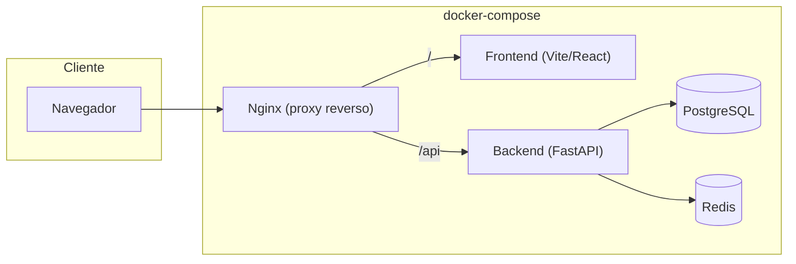
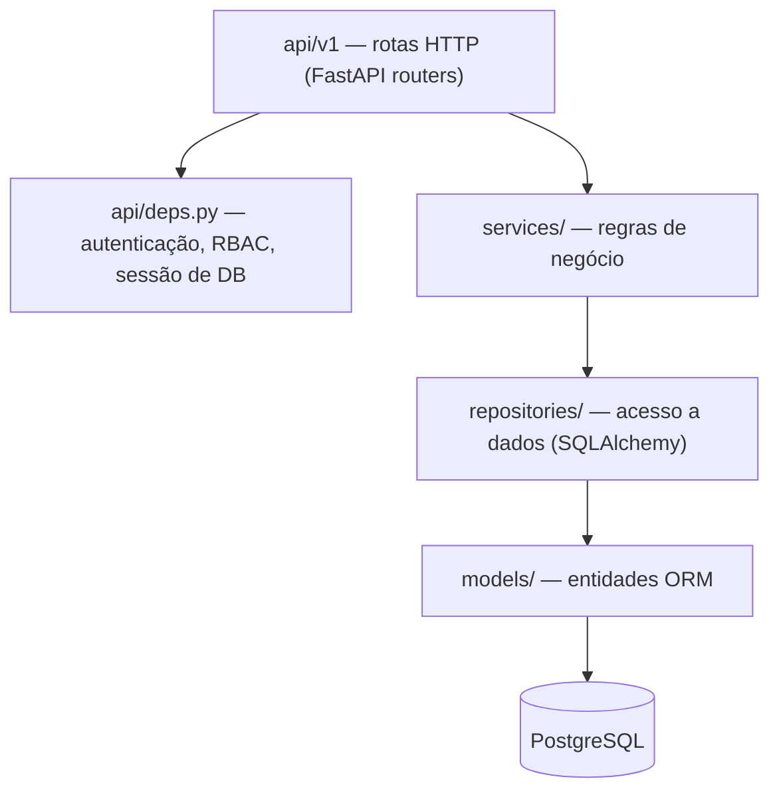

# Arquitetura — InfraHub

## Visão geral

O InfraHub é dividido em três blocos independentes, cada um com seu próprio Dockerfile, orquestrados pelo Docker Compose:

- **backend/** — API REST em FastAPI, organizada em camadas (Clean Architecture simplificada).
- **frontend/** — SPA em React + Vite, consumindo a API via React Query.
- **infra/** — configuração do Nginx (proxy reverso / servidor de estáticos).

> Em produção (`docker-compose.prod.yml`), o Nginx passa a servir os arquivos estáticos do build do frontend diretamente, sem o container `frontend`.

## Backend — arquitetura em camadas

- **api/**: rotas finas — validam entrada (Pydantic), chamam um service e traduzem exceções de domínio em `HTTPException`.
- **services/**: contêm as regras de negócio (ex.: `AuthService.authenticate`, `UserService.create_user`). Não conhecem HTTP nem SQL diretamente — dependem de repositórios.
- **repositories/**: isolam consultas SQLAlchemy. Trocar de ORM ou adicionar cache afeta só esta camada.
- **models/**: entidades mapeadas via SQLAlchemy 2.0 (`Mapped`/`mapped_column`).
- **core/**: infraestrutura transversal — configuração (`pydantic-settings`), segurança (hash de senha, JWT), logging estruturado, conexões de banco/cache.

Esse desenho segue os princípios SOLID: cada camada tem uma única responsabilidade (SRP), rotas dependem de abstrações de serviço (DIP) e novos módulos (inventário, wiki, auditoria) podem ser adicionados como novos conjuntos de model/repository/service/router sem alterar o que já existe (OCP).

## Autenticação e RBAC

- Login (`POST /api/v1/auth/login`) valida credenciais e emite um JWT de acesso contendo `sub` (id do usuário) e `role`.
- `api/deps.py` expõe `get_current_user` (decodifica e valida o token) e `require_roles(*roles)`, uma dependency factory usada para proteger rotas por perfil.
- Quatro perfis: **Administrador**, **Analista**, **Operador**, **Visualizador** (`app/models/user.py::UserRole`). Na Fase 1 apenas o Administrador tem rotas exclusivas (`GET/POST /users`); os demais perfis serão usados pelos módulos de negócio nas próximas fases.
- Um usuário administrador inicial é criado automaticamente no primeiro start (lifespan do FastAPI), a partir de `INITIAL_ADMIN_EMAIL` / `INITIAL_ADMIN_PASSWORD` no `.env`.

## Observabilidade da Fase 1

- **Logs estruturados**: todo log é emitido em JSON (`app/core/logging.py`), e cada requisição HTTP é registrada com `request_id`, método, path, status e duração (`app/middleware/logging_middleware.py`).
- **Health checks**: `GET /api/v1/health` (liveness) e `GET /api/v1/health/ready` (checa conectividade com Postgres e Redis). Usados pelos healthchecks do Docker Compose.
- Prometheus/Grafana/Loki entram na Fase 2 para consumir esses logs e métricas de forma centralizada (ver `roadmap.md`).

## Preparação para Kubernetes

Decisões da Fase 1 que facilitam uma futura migração:

- Configuração 100% via variáveis de ambiente (12-factor), sem estado em arquivo local.
- Backend stateless (sessões JWT, sem sessão de servidor); Postgres e Redis são os únicos serviços com estado.
- Health checks HTTP dedicados, mapeáveis diretamente para `livenessProbe`/`readinessProbe`.
- Imagens Docker com estágios `dev`/`prod` — o estágio `prod` é o candidato a virar a imagem publicada em um registry para deploy em K8s.
