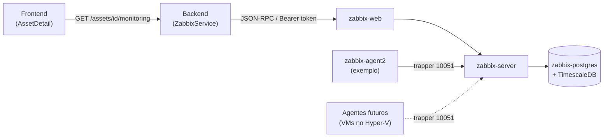

# Zabbix — InfraHub

O InfraHub reaproveita o [Zabbix](https://www.zabbix.com/) como motor de monitoramento da infraestrutura *cadastrada no inventário* (servidores, VMs, equipamentos de rede) — diferente da stack de observabilidade da Fase 2 (Prometheus/Grafana), que monitora os próprios containers do InfraHub. O vínculo entre os dois mundos é manual e simples: cada ativo do inventário pode guardar o `hostid` do host correspondente no Zabbix, e a página do ativo consulta o status ao vivo (disponibilidade + problemas ativos) diretamente na API do Zabbix.

## Arquitetura

Stack acoplável (`docker-compose.zabbix.yml`, mesmo padrão do `docker-compose.monitoring.yml`), subida junto com o restante via `scripts/zabbix.sh` / `.ps1`:

| Serviço | Imagem | Papel |
| --- | --- | --- |
| `zabbix-postgres` | `timescale/timescaledb:2.17.2-pg16` | banco dedicado do Zabbix, separado do Postgres da aplicação |
| `zabbix-timescaledb-setup` | mesma imagem (tem `psql`) | roda uma única vez (`restart: "no"`): aguarda o schema do Zabbix existir e converte as tabelas de histórico/trends em hypertables |
| `zabbix-server` | `zabbix/zabbix-server-pgsql:alpine-7.0-latest` | motor de coleta e alertas |
| `zabbix-web` | `zabbix/zabbix-web-nginx-pgsql:alpine-7.0-latest` | interface web (login padrão `Admin` / `zabbix`) |
| `zabbix-agent2` | `zabbix/zabbix-agent2:alpine-7.0-latest` | agente de exemplo, monitorando o próprio host Docker — prova a comunicação agente ↔ servidor de ponta a ponta |



### Por que TimescaleDB

O Zabbix suporta oficialmente PostgreSQL + extensão TimescaleDB para as tabelas de série temporal (`history*`, `trends*`), convertendo-as em hypertables — melhor desempenho e retenção de histórico em relação a um Postgres comum, sem trocar o banco em si. A conversão (`infra/zabbix/timescaledb-setup.sql`) só pode rodar depois que o `zabbix-server` cria o schema no primeiro start; por isso existe o serviço `zabbix-timescaledb-setup`, que espera a tabela `history` existir antes de agir e é idempotente (verifica `timescaledb_information.hypertables` antes de reprocessar).

Detalhe descoberto validando isto de verdade (e não só pela documentação geral do Zabbix): a função de "tempo atual" usada pelo `set_integer_now_func` do TimescaleDB precisa retornar exatamente o mesmo tipo da coluna `clock` — que no Zabbix 7.0 é `integer`, não `bigint` como seria razoável assumir. O `zbx_ts_unix_now()` em `timescaledb-setup.sql` está declarado `RETURNS INTEGER` por esse motivo.

### Porta 10051 exposta — para os agentes futuros no Hyper-V

O `zabbix-server` expõe a porta `10051` (protocolo trapper) no host, mesmo não sendo estritamente necessário para o agente de exemplo (que está na mesma rede Docker). O motivo é a próxima etapa fora deste projeto: subir VMs no Hyper-V (controlador de domínio, DNS etc.) e instalar o Zabbix Agent nelas, apontando para o IP da máquina que roda o InfraHub — essas VMs vão se conectar a essa porta pela rede local.

## Como obter um token de API

As imagens oficiais do Zabbix não aceitam sobrescrever a senha do usuário `Admin` via variável de ambiente — a troca da senha padrão (`Admin` / `zabbix`) é manual, pela UI, no primeiro acesso (mesmo padrão já usado para Portainer/Uptime Kuma na Fase 2).

Para gerar o token usado pelo backend (`ZABBIX_API_TOKEN`), a API do Zabbix moderna (7.0) exige dois passos — `token.create` só devolve o `tokenid`, não o segredo em si:

```bash
# 1. login e pega um authtoken de sessão
AUTH=$(curl -s http://localhost:8082/api_jsonrpc.php \
  -H 'Content-Type: application/json-rpc' \
  -d '{"jsonrpc":"2.0","method":"user.login","params":{"username":"Admin","password":"<sua-senha>"},"id":1}' \
  | jq -r '.result')

# 2. cria o token (metadado) — devolve só o tokenid
TOKENID=$(curl -s http://localhost:8082/api_jsonrpc.php \
  -H 'Content-Type: application/json-rpc' -H "Authorization: Bearer $AUTH" \
  -d '{"jsonrpc":"2.0","method":"token.create","params":{"name":"infrahub-backend"},"id":1}' \
  | jq -r '.result[0].tokenid')

# 3. gera o segredo de fato a partir do tokenid
curl -s http://localhost:8082/api_jsonrpc.php \
  -H 'Content-Type: application/json-rpc' -H "Authorization: Bearer $AUTH" \
  -d "{\"jsonrpc\":\"2.0\",\"method\":\"token.generate\",\"params\":[$TOKENID],\"id\":1}"
# -> o campo "token" da resposta é o valor de ZABBIX_API_TOKEN
```

Depois de configurar `ZABBIX_API_TOKEN` no `.env`, reinicie o backend (`docker compose up -d --build backend`).

## Como vincular um ativo

Não há sincronização automática de hosts vindo do Zabbix para o InfraHub — o vínculo é sempre iniciado a partir de um ativo específico (evita importar centenas de hosts irrelevantes de um Zabbix compartilhado). Duas formas:

1. **Manual**: no formulário de edição do ativo (`AssetFormModal`), preencha "ID do host no Zabbix" com o `hostid` de um host que já existe no Zabbix (visível na URL da página do host, na UI, ou via `host.get`).
2. **Criação automática**: se o ativo tiver um endereço IP cadastrado (campo `ip_address`, disponível em Servidor/VM/Equipamento de Rede) e ainda não estiver vinculado, a página do ativo mostra o botão "Criar host no Zabbix (IP ...)". Ele chama `POST /assets/{id}/monitoring/link-zabbix`, que:
   - garante a existência do grupo de hosts `InfraHub` no Zabbix (cria se não existir);
   - aplica o template padrão **ICMP Ping** (checagem de disponibilidade via `fping`, sem exigir Zabbix Agent instalado no destino — ideal para o primeiro momento de uma VM recém-criada no Hyper-V, antes de instalar o agente);
   - cria o host com uma interface apontando para o IP do ativo e salva o `hostid` retornado no próprio ativo.

   Ativos sem `ip_address` (ex.: Aplicação, Container) ou já vinculados não mostram o botão — nesses casos, use o vínculo manual.

A partir de qualquer um dos dois caminhos, a página do ativo passa a mostrar disponibilidade e problemas ativos, atualizados a cada 30s. Sem `zabbix_host_id` preenchido, a seção "Monitoramento" mostra apenas que o ativo não está vinculado — nenhuma chamada é feita à API do Zabbix.

**Limitação conhecida**: excluir um ativo no InfraHub não remove o host correspondente no Zabbix (são sistemas desacoplados de propósito) — se necessário, remova o host manualmente pela UI do Zabbix.

### Por que a disponibilidade é lida do item `icmpping`, não da interface do agente

`ZabbixService.get_host_status` calcula o badge de disponibilidade a partir do último valor do item `icmpping` (criado pelo template ICMP Ping, presente em todo host criado pelo InfraHub), em vez do campo `interface.available` da API. Descoberto validando com um host real: esse campo só é atualizado por *checks passivos* clássicos (servidor → agente); hosts monitorados via *active checks* (agente → servidor, o modo mais simples de liberar em firewall, ver seção seguinte) ou só por checks simples (ICMP) nunca atualizam esse campo — o badge ficaria travado em "Status desconhecido" para sempre, mesmo com o host saudável e reportando dados reais.

## Instalando o Zabbix Agent numa VM (ex.: as VMs do Hyper-V)

Para métricas reais (CPU, memória, disco, serviços) além do ping, instale o Zabbix Agent 2 na VM:

1. Baixe o instalador MSI (Windows) compatível com a versão do servidor (7.0.x) em `https://cdn.zabbix.com/zabbix/binaries/stable/7.0/<versao>/zabbix_agent2-<versao>-windows-amd64-openssl.msi`.
2. Instale em modo silencioso apontando para o IP do host que roda o Docker (o `zabbix-server` publica a porta `10051` nele):
   ```powershell
   msiexec /i zabbix_agent2.msi /qn SERVER=<IP do host Docker> SERVERACTIVE=<IP do host Docker> HOSTNAME=<nome do host no Zabbix>
   ```
   `HOSTNAME` precisa bater exatamente com o campo técnico `host` do host no Zabbix (o mesmo nome usado ao criar o ativo, sanitizado).
3. **Active checks** (agente conecta no servidor, porta 10051) evitam mexer no firewall da VM — é o caminho mais simples. Para habilitar também *passive checks* (servidor conecta no agente, porta 10050), libere a porta no firewall do Windows:
   ```powershell
   New-NetFirewallRule -DisplayName "Zabbix Agent 2 (TCP 10050)" -Direction Inbound -Protocol TCP -LocalPort 10050 -Action Allow
   ```
4. Aplique um template de agente (ex.: **Windows by Zabbix agent active**) ao host no Zabbix, além do ICMP Ping já aplicado automaticamente — isso não tem UI própria no InfraHub ainda, faça via `host.update` na API do Zabbix ou pela UI web.

## Segurança

- Credenciais padrão (`Admin` / `zabbix`) **devem** ser trocadas antes de expor a interface do Zabbix além da rede local — a imagem oficial não força a troca no primeiro acesso.
- O token de API fica só no backend (`ZABBIX_API_TOKEN`, variável de ambiente/`Secret`); o frontend nunca fala diretamente com o Zabbix.
- A porta `10051` (trapper) é o único ponto pensado para ficar acessível pela rede local além do `zabbix-web`; não exponha a porta do Postgres do Zabbix (`zabbix-postgres`) fora da rede Docker interna.
