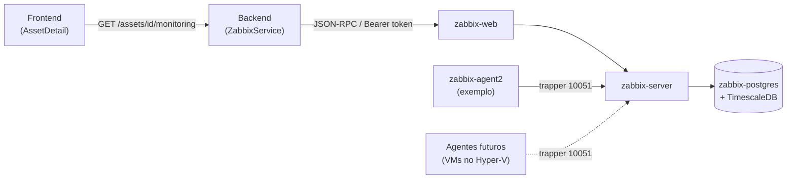

# Zabbix — InfraHub

O InfraHub reaproveita o [Zabbix](https://www.zabbix.com/) como motor de monitoramento da infraestrutura *cadastrada no inventário* (servidores, VMs, equipamentos de rede) — diferente da stack de observabilidade da Fase 2 (Prometheus/Grafana), que monitora os próprios containers do InfraHub. O vínculo entre os dois mundos é manual e simples: cada ativo do inventário pode guardar o `hostid` do host correspondente no Zabbix, e a página do ativo consulta o status ao vivo (disponibilidade + problemas ativos) diretamente na API do Zabbix.

## Arquitetura

Stack acoplável (`docker-compose.zabbix.yml`, mesmo padrão do `docker-compose.monitoring.yml`), subida junto com o restante via `scripts/zabbix.sh` / `.ps1`:

| Serviço | Imagem | Papel |
| --- | --- | --- |
| `zabbix-postgres` | `timescale/timescaledb:2.17.2-pg16` | banco dedicado do Zabbix, separado do Postgres da aplicação |
| `zabbix-timescaledb-setup` | mesma imagem (tem `psql`) | roda uma única vez (`restart: "no"`): aguarda o schema do Zabbix existir e converte as tabelas de histórico/trends em hypertables |
| `zabbix-server` | `zabbix/zabbix-server-pgsql:alpine-7.0-latest` | motor de coleta e alertas |
| `zabbix-web` | `zabbix/zabbix-web-nginx-pgsql:alpine-7.0-latest` | interface web (login padrão `Admin` / `zabbix`) |
| `zabbix-agent2` | `zabbix/zabbix-agent2:alpine-7.0-latest` | agente de exemplo, monitorando o próprio host Docker — prova a comunicação agente ↔ servidor de ponta a ponta |



### Por que TimescaleDB

O Zabbix suporta oficialmente PostgreSQL + extensão TimescaleDB para as tabelas de série temporal (`history*`, `trends*`), convertendo-as em hypertables — melhor desempenho e retenção de histórico em relação a um Postgres comum, sem trocar o banco em si. A conversão (`infra/zabbix/timescaledb-setup.sql`) só pode rodar depois que o `zabbix-server` cria o schema no primeiro start; por isso existe o serviço `zabbix-timescaledb-setup`, que espera a tabela `history` existir antes de agir e é idempotente (verifica `timescaledb_information.hypertables` antes de reprocessar).

Detalhe descoberto validando isto de verdade (e não só pela documentação geral do Zabbix): a função de "tempo atual" usada pelo `set_integer_now_func` do TimescaleDB precisa retornar exatamente o mesmo tipo da coluna `clock` — que no Zabbix 7.0 é `integer`, não `bigint` como seria razoável assumir. O `zbx_ts_unix_now()` em `timescaledb-setup.sql` está declarado `RETURNS INTEGER` por esse motivo.

### Porta 10051 exposta — para os agentes futuros no Hyper-V

O `zabbix-server` expõe a porta `10051` (protocolo trapper) no host, mesmo não sendo estritamente necessário para o agente de exemplo (que está na mesma rede Docker). O motivo é a próxima etapa fora deste projeto: subir VMs no Hyper-V (controlador de domínio, DNS etc.) e instalar o Zabbix Agent nelas, apontando para o IP da máquina que roda o InfraHub — essas VMs vão se conectar a essa porta pela rede local.

## Como obter um token de API

As imagens oficiais do Zabbix não aceitam sobrescrever a senha do usuário `Admin` via variável de ambiente — a troca da senha padrão (`Admin` / `zabbix`) é manual, pela UI, no primeiro acesso (mesmo padrão já usado para Portainer/Uptime Kuma na Fase 2).

Para gerar o token usado pelo backend (`ZABBIX_API_TOKEN`), a API do Zabbix moderna (7.0) exige dois passos — `token.create` só devolve o `tokenid`, não o segredo em si:

```bash
# 1. login e pega um authtoken de sessão
AUTH=$(curl -s http://localhost:8082/api_jsonrpc.php \
  -H 'Content-Type: application/json-rpc' \
  -d '{"jsonrpc":"2.0","method":"user.login","params":{"username":"Admin","password":"<sua-senha>"},"id":1}' \
  | jq -r '.result')

# 2. cria o token (metadado) — devolve só o tokenid
TOKENID=$(curl -s http://localhost:8082/api_jsonrpc.php \
  -H 'Content-Type: application/json-rpc' -H "Authorization: Bearer $AUTH" \
  -d '{"jsonrpc":"2.0","method":"token.create","params":{"name":"infrahub-backend"},"id":1}' \
  | jq -r '.result[0].tokenid')

# 3. gera o segredo de fato a partir do tokenid
curl -s http://localhost:8082/api_jsonrpc.php \
  -H 'Content-Type: application/json-rpc' -H "Authorization: Bearer $AUTH" \
  -d "{\"jsonrpc\":\"2.0\",\"method\":\"token.generate\",\"params\":[$TOKENID],\"id\":1}"
# -> o campo "token" da resposta é o valor de ZABBIX_API_TOKEN
```

Depois de configurar `ZABBIX_API_TOKEN` no `.env`, reinicie o backend (`docker compose up -d --build backend`).

## Como vincular um ativo

Não há sincronização automática de hosts — o vínculo é manual e intencional (evita importar centenas de hosts irrelevantes de um Zabbix compartilhado). No formulário de edição do ativo (`AssetFormModal`), preencha "ID do host no Zabbix" com o `hostid` do host correspondente (visível na URL da página do host, na UI do Zabbix, ou via `host.get`). A partir daí, a página do ativo passa a mostrar disponibilidade e problemas ativos, atualizados a cada 30s.

Sem `zabbix_host_id` preenchido, a seção "Monitoramento" do ativo mostra apenas que ele não está vinculado — nenhuma chamada é feita à API do Zabbix.

## Segurança

- Credenciais padrão (`Admin` / `zabbix`) **devem** ser trocadas antes de expor a interface do Zabbix além da rede local — a imagem oficial não força a troca no primeiro acesso.
- O token de API fica só no backend (`ZABBIX_API_TOKEN`, variável de ambiente/`Secret`); o frontend nunca fala diretamente com o Zabbix.
- A porta `10051` (trapper) é o único ponto pensado para ficar acessível pela rede local além do `zabbix-web`; não exponha a porta do Postgres do Zabbix (`zabbix-postgres`) fora da rede Docker interna.
